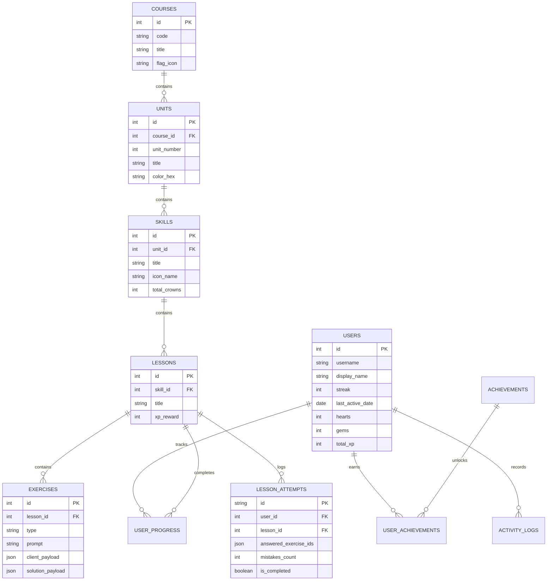

# Duolingo Web Application Clone

A fullstack web application clone of Duolingo replicating its design, user experience, core lesson player, and gamification workflows.

Built as an SDE Fullstack Assignment following modern software engineering practices, clean architecture, and strict separation of concerns.

---

## 🚀 Key Features

### 1. Authentic Duolingo Look & Feel
- **Tactile 3D Buttons**: Signature beveled borders with realistic press micro-interactions (`border-bottom` collapsing on click).
- **Duolingo Color System**: Faithful palette with brand greens (`#58cc02`), blues (`#1cb0f6`), reds (`#ff4b4b`), yellows (`#ffc800`), and dark mode tokens.
- **Duo Mascot & Celebratory Flourishes**: SVG illustrations of Duo the Owl in cheering, coaching, and crying states.
- **Web Audio Sound Effects**: Low-latency procedural sound synthesizer for button taps, correct chords, wrong buzzes, heart breaks, and victory fanfares.
- **Web Speech API Text-to-Speech**: Authentic pronunciation of vocabulary sentences in Spanish.
- **Celebratory Confetti**: Interactive confetti cannon on lesson completion.
- **Dark Mode**: Full toggleable dark mode respecting Duolingo's dark theme palette.

### 2. Learning Path / Skill Tree (`/learn`)
- **Serpentine Winding Path**: Mathematical curve offset placing skill circles along an authentic curved path.
- **Unit Cards & Guidebooks**: Unit titles, descriptions, and guidebook previews.
- **Skill States**: Visually distinct Completed (Gold with crown badge), Available (pulsing glow with Duo mascot cameo), and Locked states.
- **Milestone Treasure Chests**: Periodic reward chests along the trail.
- **Sticky Status Header / Sidebar**: Real-time streak counter (🔥), gems (💎), and hearts (❤️).

### 3. The Lesson Player (`/lesson/[id]`)
- **Distraction-Free Interface**: Clean header with exit confirmation modal, animated smooth progress bar, and active heart indicator.
- **All 5 Required Exercise Types**:
  1. **Multiple Choice**: Image and text option cards with keyboard number shortcuts (`1`, `2`, `3`) and TTS speaker button.
  2. **Translate (Word Bank)**: Sentence prompt with Duo speech bubble, answer slot tray, and interactive tappable word bank tokens.
  3. **Match Pairs**: 2 columns of vocabulary tiles with match flash and mismatch shake animations.
  4. **Fill in the Blank**: Sentence with inline blank slot and choice pills.
  5. **Type the Answer**: Text field with real-time Spanish accent buttons (`á`, `é`, `í`, `ó`, `ú`, `ñ`).
- **Signature Bottom Feedback Sheet**:
  - **Correct State**: Vibrant green bottom banner, "Nicely done!" message, and green "CONTINUE" button.
  - **Incorrect State**: Vibrant red bottom banner, "Correct solution:" display, and red "CONTINUE" button.
- **Heart Loss & Out of Hearts Flow**: Mistakes decrement hearts in real time with audio cues. Reaching 0 hearts triggers the "Out of Hearts" dialog with options to refill with gems or return to practice.
- **Celebration Screen**: Lesson summary featuring XP gained, accuracy percentage, streak extension, and confetti.

### 4. Gamification & Progress Persistence
- **Daily Streak Engine**: Tracks daily activity dates, increments streaks, and logs XP into user activity logs.
- **Hearts System**: 5-heart cap, real-time deduction on errors, gems refill (350 gems), and practice-to-earn-hearts mode.
- **Tiered League Leaderboards (`/leaderboard`)**: Weekly Ruby League table featuring user ranking dynamically adjusting against 9 seeded competitors.
- **Daily Quests (`/quests`)**: Progress bars for daily XP goals and lesson milestones with gem rewards.
- **Learner Profile (`/profile`)**: Total XP, streak record, current league, and achievements showcase (Wildfire, Sage, Sharpshooter, Champion).
- **Power-Ups Shop (`/shop`)**: Heart refills, Streak Freezes, Double-or-Nothing wagers, and Super Duolingo preview.

---

## 🛠️ Architecture & Tech Stack

```
Duolingo Clone
├── frontend/ (Next.js 14 App Router, TypeScript, Vanilla CSS Modules)
│   ├── src/app/
│   │   ├── learn/page.tsx         # Learning path serpentine home
│   │   ├── lesson/[id]/page.tsx   # Interactive core lesson player
│   │   ├── leaderboard/page.tsx   # League standings
│   │   ├── quests/page.tsx        # Daily goals and quests
│   │   ├── profile/page.tsx       # User stats and achievements
│   │   └── shop/page.tsx          # Gems shop and powerups
│   ├── src/components/
│   │   ├── layout/                # Sidebar, RightSidebar, HeartsModal
│   │   ├── path/                  # LearningPath, UnitSection, SkillNode
│   │   └── lesson/                # 5 Exercise renderers, FeedbackBar, Modals
│   └── src/lib/                   # API client, Web Audio SFX, Web Speech TTS
│
└── backend/ (Python 3.11+, FastAPI, SQLAlchemy, SQLite)
    ├── app/
    │   ├── core/                  # Database engine, config, session
    │   ├── models/                # Normalized SQLAlchemy models
    │   ├── schemas/               # Pydantic v2 validation contracts
    │   ├── services/              # Authoritative answer validation, streak logic
    │   ├── api/v1/endpoints/      # REST API routers (courses, lessons, user, lb)
    │   └── seeds/seed_data.py     # Pre-seeded Spanish curriculum & learner
    └── tests/test_api.py          # End-to-end automated test suite
```

### Backend-Authoritative Validation & Security
1. **Sanitized Exercise Payloads**: The frontend receives only `client_payload` (options text/image, shuffled tokens, pair words). Solutions (`correct_option_id`, `canonical_tokens`, `acceptable_answers`) are retained strictly on the backend.
2. **Anti-Duplicate Submission Protection**: Each lesson session creates a unique `attempt_id`. The backend rejects or safely ignores duplicate submissions of the same exercise within an attempt, preventing race conditions or exploit-driven XP duplication.
3. **Idempotent Gamification Calculations**: XP, streaks, hearts, and achievements are computed and committed atomically on the backend.

---

## 📊 Database Schema (SQLite)



---

## ⚡ Quickstart & Local Setup

### Prerequisites
- **Node.js** (v18 or higher)
- **Python** (v3.10 or higher)

### 1. Start the Backend API
```bash
cd backend
python -m venv venv

# Windows
.\venv\Scripts\activate
# Linux/macOS
source venv/bin/activate

pip install -r requirements.txt

# Run backend server (auto-seeds SQLite database on first startup)
python run.py
```
Backend will be live at: `http://127.0.0.1:8000`  
Interactive Swagger API documentation: `http://127.0.0.1:8000/api/v1/docs`

### 2. Start the Frontend Web App
```bash
cd frontend
npm install
npm run dev
```
Open your browser at: `http://localhost:3000`

### 3. Run Backend Automated Tests
```bash
cd backend
.\venv\Scripts\python tests\test_api.py
```

---

## 🧪 Evaluation & Demo Flow

1. Open `http://localhost:3000` (redirects to `/learn`).
2. Observe pre-seeded learner **Alex Ramos** with **7-day streak**, **345 XP**, and **5 hearts**.
3. Notice **Unit 1**: "Basics" is marked Completed (👑 3/3 crowns), and "Greetings" is Available with the pulsing ring and Duo mascot.
4. Click **Greetings** and click **START (+15 XP)** to enter the Lesson Player (`/lesson/3`).
5. Experience the interactive exercises:
   - Multiple Choice with keyboard shortcuts `1`, `2`, `3`.
   - Word Bank sentence translation with interactive slot placement.
   - Match Pairs with green match confirmation.
   - Fill in the blank and free typing with accented character helpers.
6. Submit an incorrect answer to observe the red feedback sheet, sound cue, and heart deduction (`5 -> 4`).
7. Complete all exercises to trigger the **victory fanfare**, **confetti blast**, and **XP celebration**.
8. Return to `/learn` to see the newly unlocked progress reflected.
