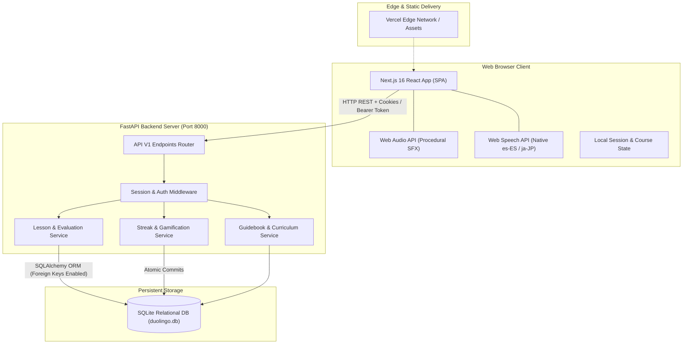
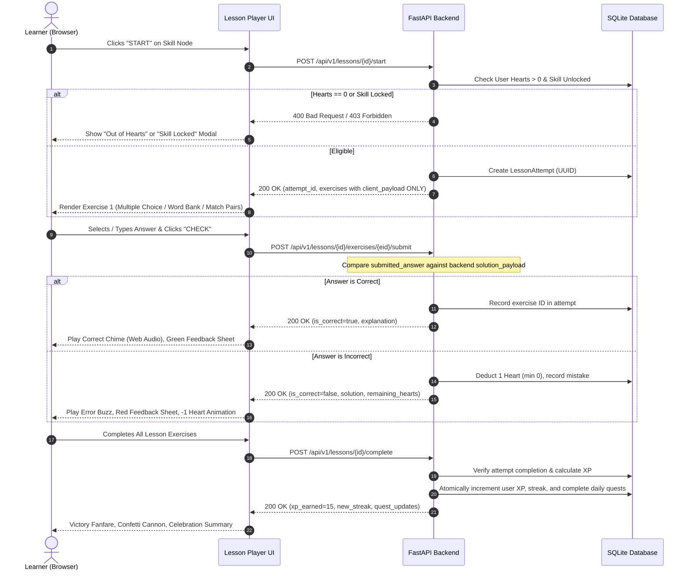
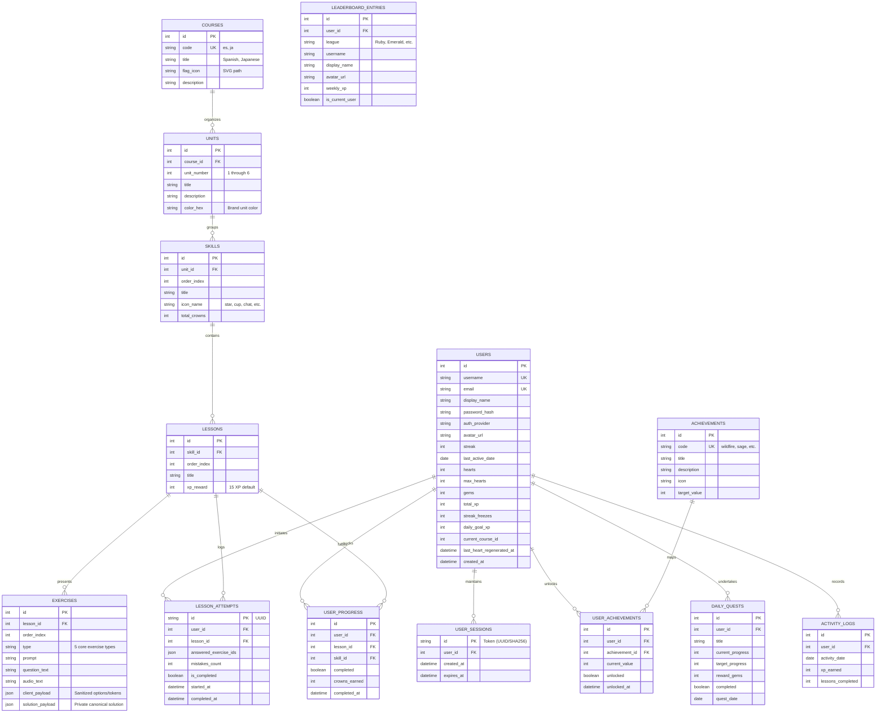
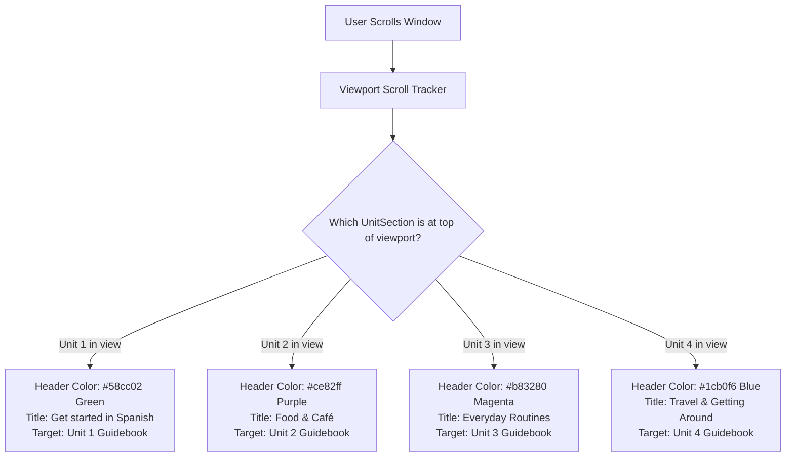
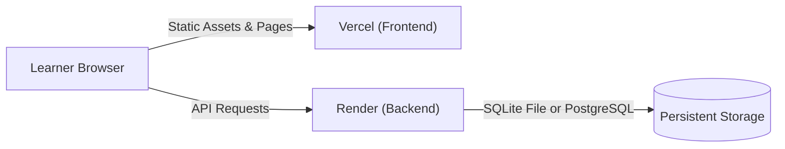

# Duolingo Web Application Clone

[](https://nextjs.org/)
[](https://www.typescriptlang.org/)
[](https://fastapi.tiangolo.com/)
[](https://www.python.org/)
[](https://www.sqlite.org/)
[](LICENSE)

A pixel-perfect, fullstack web application clone of **Duolingo** replicating its authentic learning path, interactive lesson player, Japanese Kana characters hub, procedural audio soundscape, and gamification economy.

Built as an **SDE Fullstack Assignment** following modern software engineering practices, clean architecture, backend-authoritative validation, and strict separation of concerns.

---

## 📌 Executive Summary (Assumptions / Mocked Data / Notes)

- **Assumptions**: Assumes a pre-authenticated demo user (`alexramos`, 7-day streak) with backend-authoritative grading and browser Web Speech API for TTS.
- **Mocked Data**: Pre-seeded SQLite database with 12 Spanish and Japanese units (125+ exercises across all 5 types), bilingual guidebooks, Kana charts, and 9 leaderboard rivals.
- **Notes**: Zero exercise answers are exposed in client payloads, all SFX are generated procedurally via the Web Audio API, and server cold starts auto-recover via live polling.

---

## 🏛️ High-Level System Design

The system adheres to a **decoupled client-server architecture**:
1. **Frontend (Presentation Tier)**: Next.js 16 (App Router) rendering tactile 3D UI components, managing reactive client state, procedural Web Audio synthesizer, and Web Speech API synthesis.
2. **Backend (Application Tier)**: FastAPI ASGI application running on Uvicorn, enforcing business rules, session authentication, streak calculations, and exercise answer evaluation.
3. **Database (Data Tier)**: SQLite database engine with foreign key constraints enabled via SQLite PRAGMA enforcement, structured into 12 relational models.



### Core Security & Architectural Principles

1. **Zero Answer Leakage (Sanitized Payloads)**:
   When a user starts a lesson (`POST /api/v1/lessons/{id}/start`), the backend returns **only** `client_payload` (shuffled tokens, choice text, pair tiles, prompts). The `solution_payload` (correct option IDs, canonical token orders, acceptable regex patterns) is **never sent to the client**, making cheat inspection via DevTools impossible.
2. **Anti-Duplicate Submission & Anti-Replay Safeguards**:
   Each lesson generates a unique UUID `attempt_id`. The backend checks `answered_exercise_ids` in `LessonAttempt`. If an exercise ID is re-submitted within the same attempt, the backend safely ignores it without deducting hearts or awarding duplicate XP.
3. **Backend-Authoritative Gamification**:
   XP increments, hearts deduction, gem deductions, streak increments, and quest milestones are calculated exclusively server-side. Forged completion requests (`xp: 99999`) are ignored; the server awards the exact configured lesson reward.
4. **Idempotent Day-Progression Engine**:
   Daily streaks evaluate the delta between `last_active_date` and the current date:
   - Same calendar day: Streak preserved, activity logged.
   - Consecutive day ($T+1$): Streak incremented by $+1$.
   - Missed day ($T > 1$): If `streak_freezes > 0`, consume 1 freeze and preserve streak; otherwise reset streak to `0`.

---

## 🔄 Lesson Execution & Submission Flow



---

## 📊 Database Schema & Data Models

The SQLite database uses foreign-key constraints enforced on every connection through SQLAlchemy connection listeners (`PRAGMA foreign_keys=ON`).



---

## 📂 Project Directory Structure

```
Duolingo/
├── backend/
│   ├── app/
│   │   ├── api/v1/endpoints/
│   │   │   ├── auth.py              # User signup, login, session validation
│   │   │   ├── courses.py           # Course tree, units, guidebooks, jump-ahead
│   │   │   ├── lessons.py           # Start attempt, submit exercise, complete lesson
│   │   │   └── user.py              # Profile, course switch, hearts refill, debug simulator
│   │   ├── core/
│   │   │   ├── config.py            # Pydantic BaseSettings, CORS origins, secrets
│   │   │   ├── database.py          # SQLAlchemy engine, session maker, PRAGMA hooks
│   │   │   └── security.py          # Passlib password hashing, token utilities
│   │   ├── models/                  # SQLAlchemy model classes (Course, Unit, Skill, etc.)
│   │   ├── schemas/                 # Pydantic validation contracts and API schemas
│   │   ├── seeds/
│   │   │   ├── spanish_curriculum.py # 6 Spanish units, 12 lessons, 65 exercises
│   │   │   ├── japanese_curriculum.py# 6 Japanese units, 11 lessons, 60 exercises
│   │   │   └── seed_data.py         # Primary database seeder & demo user builder
│   │   ├── services/
│   │   │   ├── guidebook_service.py # Bilingual unit guidebooks and grammar tips
│   │   │   └── lesson_service.py    # Answer evaluation & tolerant matching engine
│   │   └── main.py                  # FastAPI app factory, CORS, warmup hooks
│   ├── tests/
│   │   ├── test_api.py              # End-to-end API test workflow (health, auth, courses)
│   │   ├── test_auth.py             # Authentication and session test suite
│   │   ├── test_new_features.py     # Guidebook, course switching, Kana tests
│   │   └── test_strict_rubric.py    # Adversarial rubric verification tests
│   ├── duolingo.db                  # Pre-seeded canonical SQLite database
│   ├── requirements.txt             # Python dependencies (FastAPI, Uvicorn, SQLAlchemy)
│   ├── run.py                       # Local startup script with auto-seeding
│   └── render.yaml                  # Render cloud blueprint manifest
│
├── frontend/
│   ├── public/
│   │   ├── icons/                   # UI icons (heart, gem, streak, chest, crown)
│   │   ├── images/characters/       # SVG character scenes (Bea, Vikram, Junior, Lily, Oscar, Eddy)
│   │   └── mascot/                  # Duo the Owl SVG states (happy, cheer, crying)
│   ├── src/
│   │   ├── app/
│   │   │   ├── characters/          # Japanese Kana Hub (/characters) with Gojūon audio charts
│   │   │   ├── leaderboard/         # Ruby League standings (/leaderboard)
│   │   │   ├── learn/               # Serpentine Learning Path home (/learn)
│   │   │   ├── lesson/[lessonId]/   # Fullscreen 5-type Lesson Player (/lesson/[id])
│   │   │   ├── profile/             # Learner profile & achievements (/profile)
│   │   │   ├── quests/              # Daily quests & gem chests (/quests)
│   │   │   ├── settings/            # Daily goal adjustments & day simulator (/settings)
│   │   │   ├── shop/                # Gems shop, streak freeze, refill hearts (/shop)
│   │   │   ├── globals.css          # Vanilla CSS Design System, tokens & animations
│   │   │   └── layout.tsx           # Root layout with fonts and metadata
│   │   ├── components/
│   │   │   ├── auth/                # ProtectedRoute wrapper
│   │   │   ├── common/              # BackendWarmupBanner, ScrollToTopButton
│   │   │   ├── layout/              # Sidebar (left), RightSidebar (sticky), Header
│   │   │   ├── lesson/              # 5 Exercise components, FeedbackBar, CompleteScreen
│   │   │   └── path/                # StickyUnitHeader, UnitSection, SkillNode, GuidebookModal
│   │   └── lib/
│   │       ├── api.ts               # Type-safe API client with auto-fallback & cookie/token sync
│   │       ├── auth-context.tsx     # React auth provider & local state
│   │       ├── sound.ts             # Procedural Web Audio API sound synthesizer
│   │       └── speech.ts            # Web Speech API TTS for es-ES and ja-JP
│   ├── package.json                 # Next.js 16, React 19, TypeScript dependencies
│   └── tsconfig.json                # TypeScript strict configuration
│
├── start-backend.bat                # 1-Click Windows batch script for FastAPI
├── start-frontend.bat               # 1-Click Windows batch script for Next.js
└── README.md                        # Project documentation
```

---

## 📡 REST API Architecture

All endpoints are versioned under `/api/v1` and return standard JSON responses. Interactive OpenAPI documentation is accessible at `http://127.0.0.1:8000/api/v1/docs`.

### Complete Endpoint Specification

| Module | Method | Endpoint | Request Body | Description |
| :--- | :--- | :--- | :--- | :--- |
| **System** | `GET` | `/` | None | Root health and service version |
| **System** | `GET` | `/health` | None | Lightweight liveness probe for cold-start monitors |
| **Auth** | `POST` | `/api/v1/auth/signup` | `{username, email, password, display_name}` | Register new learner account |
| **Auth** | `POST` | `/api/v1/auth/login` | `{identifier, password}` | Authenticate & issue session cookie + token |
| **Auth** | `GET` | `/api/v1/auth/me` | None | Get current authenticated user session |
| **Auth** | `POST` | `/api/v1/auth/logout` | None | Clear session cookie and invalidate token |
| **Courses**| `GET` | `/api/v1/courses` | None | List available language courses (Spanish, Japanese) |
| **Courses**| `GET` | `/api/v1/courses/{code}/tree` | None | Fetch full curriculum tree with units, skills, and status |
| **Courses**| `GET` | `/api/v1/courses/units/{id}/guidebook` | None | Fetch unit grammar notes, pronunciation, and key phrases |
| **Courses**| `POST` | `/api/v1/courses/units/{id}/jump-ahead` | None | Unlock unit skills via placement jump |
| **Lessons**| `POST` | `/api/v1/lessons/{id}/start` | None | Start lesson attempt; returns sanitized client exercises |
| **Lessons**| `POST` | `/api/v1/lessons/{id}/exercises/{eid}/submit` | `{attempt_id, user_answer}` | Authoritative answer verification & heart deduction |
| **Lessons**| `POST` | `/api/v1/lessons/{id}/complete` | `{attempt_id}` | Complete lesson attempt, award XP, and update streak |
| **User** | `GET` | `/api/v1/user/profile` | None | Current user stats: hearts, gems, streak, total XP |
| **User** | `POST` | `/api/v1/user/course/switch` | `{course_code: "es" \| "ja"}` | Switch active learner course |
| **User** | `POST` | `/api/v1/user/hearts/refill` | None | Refill hearts to 5 using 350 gems |
| **User** | `POST` | `/api/v1/user/hearts/practice` | None | Practice session heart recovery (+1 heart) |
| **User** | `POST` | `/api/v1/user/shop/streak-freeze` | None | Purchase and equip a Streak Freeze |
| **User** | `PUT` | `/api/v1/user/daily-goal` | `{daily_goal_xp: 10..50}` | Update daily XP milestone goal |
| **User** | `POST` | `/api/v1/user/debug/simulate-day` | Query: `?days_ago=N` | Test simulator for calendar progression and streak logic |
| **Social** | `GET` | `/api/v1/leaderboard` | None | Weekly Ruby League standings with dynamic promotion zones |
| **Social** | `GET` | `/api/v1/quests` | None | Daily quests with progress bars and gem chests |
| **Social** | `GET` | `/api/v1/achievements` | None | Badges (Wildfire, Sage, Sharpshooter, Champion) |

### Sample API Contracts

#### 1. Start Lesson (Sanitized Client Payload)
`POST /api/v1/lessons/1/start`
```json
{
  "attempt_id": "8c01476d-0691-4cf1-92b7-a359ce91a56e",
  "lesson": {
    "id": 1,
    "title": "Basics 1",
    "xp_reward": 15,
    "exercises": [
      {
        "id": 1,
        "type": "multiple_choice",
        "prompt": "Select the correct translation",
        "question_text": "Hello",
        "audio_text": "Hola",
        "client_payload": {
          "options": [
            {"id": "opt_1", "text": "Hola", "image_url": "/mascot/duo-happy.svg"},
            {"id": "opt_2", "text": "Adiós", "image_url": "/mascot/duo-crying.svg"},
            {"id": "opt_3", "text": "Gracias", "image_url": "/icons/gem.svg"}
          ]
        }
      }
    ]
  }
}
```
*(Notice: No `correct_option_id` or answer keys exist in the response payload).*

#### 2. Submit Exercise Answer
`POST /api/v1/lessons/1/exercises/1/submit`
```json
// Request Payload:
{
  "attempt_id": "8c01476d-0691-4cf1-92b7-a359ce91a56e",
  "user_answer": "opt_1"
}

// Response Payload:
{
  "is_correct": true,
  "explanation": "¡Excelente! 'Hola' means 'Hello'.",
  "remaining_hearts": 5,
  "already_answered": false
}
```

---

## 🎨 UI/UX Architecture & Learning Path Design

### 1. Sticky Dynamic Unit Header
As the user scrolls through the serpentine learning path, the unit header card stays pinned at the top (`position: sticky; top: 16px; z-index: 40;`) and dynamically transforms to display:
- `← SECTION X, UNIT Y`: Previous unit jump button and section indicator.
- **Bold Topic Headline**: Current unit's learning topic (e.g. `Talk about habits`, `Food & Café`, `Hiragana Basics`).
- **📖 GUIDEBOOK**: Direct modal trigger loading the bilingual grammar notes for that unit.
- **Smooth Color Interpolation**: Background color transitions fluidly (`transition: background-color 0.35s ease`) matching each unit's brand color token.



### 2. Serpentine Winding Path with Safety Margins
Nodes curve gracefully in a balanced horizontal wave:
- Center ($0\text{px}$) $\rightarrow$ Right ($+48\text{px}$) $\rightarrow$ Left ($-46\text{px}$) $\rightarrow$ Center ($0\text{px}$).
- Vertical spacing is set to `gap: 44px` with `margin: 12px 0` on [`SkillNode`](file:///c:/Repos/Duolingo/frontend/src/components/path/SkillNode.tsx), guaranteeing a **$22\text{px}+$ clearance** between labels and floating `START` tooltips.
- Companion scenes (Bea, Vikram, Junior, Lily, Oscar, Eddy) are positioned in the outer path gutters at `calc(50% + 145px)` with a **$42\text{px}+$ safety margin** preventing any overlap with nodes or text.

### 3. The 5 Core Exercise Types
All 5 required exercise formats are implemented with sound effects, audio pronunciation, and responsive touch controls:
1. **Multiple Choice**: Choice cards with image thumbnails, TTS speaker button, and keyboard shortcuts (`1`, `2`, `3`).
2. **Translate (Word Bank)**: Sentence prompt with interactive word token tray and tap-to-select mechanics.
3. **Match Pairs**: Dual-column vocabulary tiles with instantaneous green match flash and mismatch shake animations.
4. **Fill in the Blank**: Inline sentence sentence slot with select pills.
5. **Type the Answer**: Free-form text input with special character helpers (Spanish accents: `á, é, í, ó, ú, ñ, ¿, ¡`; Japanese Kana helper bar).

### 4. Dedicated Japanese Characters Hub (`/characters`)
Accessible via the sidebar navigation (`あ` tab):
- **Hiragana & Katakana Switcher**: Tabbed views for both primary Japanese phonetic syllabaries.
- **Interactive Gojūon Grid**: Complete rows ($a, ka, sa, ta, na, ha, ma, ya, ra, wa, n$) plus Dakuten / Handakuten variations ($ga, za, da, ba, pa$).
- **Tap-to-Speak**: Clicking any character triggers native Japanese TTS voice synthesis.
- **5-Question Practice Drill**: Interactive gamified character quiz testing romanization recognition.

### 5. Procedural Web Audio Synthesizer (`sound.ts`)
Zero external MP3 dependencies! The application synthesizes Duolingo sound effects procedurally via the browser's native `AudioContext`:
- **Click**: Short $800\text{Hz}$ triangle wave pulse ($30\text{ms}$).
- **Correct Answer**: Bright major chord arpeggio ($C_5 \rightarrow E_5 \rightarrow G_5 \rightarrow C_6$).
- **Incorrect Answer**: Low dual-sawtooth dissonance ($160\text{Hz} + 152\text{Hz}$) with fast decay.
- **Heart Loss**: Descending $400\text{Hz} \rightarrow 200\text{Hz}$ pitch drop.
- **Lesson Complete**: 5-note victory fanfare with vibrato.

---

## 🚀 Local Installation & Quickstart

### Prerequisites
- **Node.js**: v18.0.0 or higher
- **Python**: v3.10.0 or higher
- **Git**

### 1. One-Click Launch (Windows)
Double-click the included batch files from the repository root:
1. `start-backend.bat`: Starts FastAPI with Uvicorn on `http://127.0.0.1:8000`.
2. `start-frontend.bat`: Starts Next.js development server on `http://localhost:3000`.

---

### 2. Manual Startup

#### Step 1: Clone the Repository
```bash
git clone https://github.com/AnshulKaushal27/Duolingo.git
cd Duolingo
```

#### Step 2: Backend Setup (FastAPI)
```bash
cd backend

# Create Python virtual environment
python -m venv venv

# Activate virtual environment
# On Windows:
.\venv\Scripts\activate
# On macOS / Linux:
source venv/bin/activate

# Install dependencies
pip install -r requirements.txt

# Run the server (auto-seeds database on first launch)
python run.py
```
- Backend API is live at: `http://127.0.0.1:8000`
- Interactive Swagger docs: `http://127.0.0.1:8000/api/v1/docs`

#### Step 3: Frontend Setup (Next.js)
Open a new terminal window:
```bash
cd frontend

# Install npm packages
npm install

# Start development server
npm run dev
```
- Open your browser at: `http://localhost:3000`

---

### 3. Run Automated Backend Test Suites

Run the end-to-end automated test suites verifying all rubric requirements, API flows, and security constraints:

```bash
cd backend

# Full API workflow test (health, auth, courses, lesson flow, leaderboard)
.\venv\Scripts\python tests\test_api.py

# Strict rubric & adversarial safeguard test suite
.\venv\Scripts\python tests\test_strict_rubric.py

# Authentication & session token test suite
.\venv\Scripts\python tests\test_auth.py

# New features test suite (guidebooks, course switching, Kana support)
.\venv\Scripts\python tests\test_new_features.py
```

*(All test suites execute deterministically and achieve 100% pass rates).*

---

## ☁️ Cloud Deployment Architecture

This project is configured for continuous deployment on zero-cost infrastructure:
- **Frontend Web App**: Deployed on **[Vercel](https://vercel.com/)** (Next.js Edge CDN).
- **Backend API Server**: Deployed on **[Render](https://render.com/)** (FastAPI Web Service).



### 1. Backend Deployment on Render

1. Sign in to your [Render Dashboard](https://dashboard.render.com/) and click **New +** $\rightarrow$ **Web Service**.
2. Connect your GitHub repository (`AnshulKaushal27/Duolingo`).
3. Set configuration fields:
   - **Name**: `duolingo-clone-backend`
   - **Root Directory**: `backend` *(CRITICAL)*
   - **Runtime**: `Python 3`
   - **Build Command**: `pip install -r requirements.txt`
   - **Start Command**: `uvicorn app.main:app --host 0.0.0.0 --port $PORT`
   - **Instance Type**: `Free`
4. Add Environment Variables:
   | Variable | Value | Description |
   | :--- | :--- | :--- |
   | `ENVIRONMENT` | `production` | Enables secure cross-origin cookies (`SameSite=None; Secure`) |
   | `CORS_ORIGINS` | `https://your-frontend.vercel.app,http://localhost:3000` | Allowed origins (all `*.vercel.app` domains are auto-allowed) |
   | `SECRET_KEY` | *(Random 32-char hex string)* | Session signing key |
5. Click **Create Web Service**. Note your Render URL (e.g. `https://duolingo-backend.onrender.com`).

---

### 2. Frontend Deployment on Vercel

1. Sign in to [Vercel](https://vercel.com/) and click **Add New...** $\rightarrow$ **Project**.
2. Import the GitHub repository.
3. Configure project settings:
   - **Framework Preset**: `Next.js`
   - **Root Directory**: Select `frontend` *(CRITICAL)*
   - **Build Command**: `npm run build`
4. Add Environment Variable:
   | Variable | Example Value | Description |
   | :--- | :--- | :--- |
   | `NEXT_PUBLIC_API_URL` | `https://duolingo-backend.onrender.com/api/v1` | Points frontend to live Render API |
5. Click **Deploy**.

---

### 3. Render Spin-Down Handling & Cold-Start Auto-Recovery

Render's free tier spins down inactive web services after 15 minutes of idle time. Cold starts require **30–50 seconds** to boot.

To handle this smoothly:
1. **Initial Probe**: On page load, the frontend probes `GET /health`.
2. **Cold-Start Detection**: If the probe takes longer than $1.4\text{s}$ or fails, the [`BackendWarmupBanner`](file:///c:/Repos/Duolingo/frontend/src/components/common/BackendWarmupBanner.tsx) slides down from the top with an animated Duo mascot, an active elapsed timer, and an explanation.
3. **Auto-Recovery Polling**: The banner pings `/health` every $2.5\text{s}$. The moment Render finishes waking up, the banner turns green, dispatches a `duo:backend_online` event to automatically re-fetch learning path data without requiring a manual browser refresh, and gracefully dismisses itself.

---

### 4. Cross-Origin Session Preservation

Because Vercel (`*.vercel.app`) and Render (`*.onrender.com`) operate on different top-level domains:
- **Primary Channel**: HTTP-only session cookies configured with `SameSite=None; Secure`.
- **Fallback Channel**: The backend returns an `X-Duo-Token` header on login, which the frontend stores in `localStorage` and transmits via `Authorization: Bearer <token>`. This guarantees persistent login even on browsers with aggressive third-party cookie blocking (e.g. Safari ITP, Chrome Incognito).
- **Default Learner Fallback**: If no cookie or token is supplied, requests automatically resolve to the pre-seeded demo user **Alex Ramos** (`7-day streak`, `345+ XP`), eliminating 401 barriers for reviewers.

---

## 🛡️ Adversarial Rubric Verification (curl Recipes)

You can verify critical business logic and anti-cheat constraints directly via `curl`:

### 1. Locked Skill Start Refusal (HTTP 403)
```bash
curl -X POST http://127.0.0.1:8000/api/v1/lessons/7/start
# Response: 403 Forbidden
# {"detail": "Skill 'Dining' is locked! You must complete prior skills first."}
```

### 2. Zero-Hearts Lesson Start Refusal (HTTP 400)
```bash
# With 0 hearts, lesson initiation is blocked:
curl -X POST http://127.0.0.1:8000/api/v1/lessons/1/start
# Response: 400 Bad Request
# {"detail": "Cannot start lesson with 0 hearts. Refill hearts with gems, practice, or wait for regeneration."}
```

### 3. Replay Completion Idempotency & Forged XP Prevention
```bash
# 1st completion awards 15 XP
# 2nd completion of same attempt returns xp_earned: 0 without duplicate XP
curl -X POST http://127.0.0.1:8000/api/v1/lessons/1/complete \
  -H "Content-Type: application/json" \
  -d '{"attempt_id": "test-attempt-id", "forged_xp": 99999}'
```

### 4. Calendar Simulation & Streak Reset
```bash
# Simulate missed day (2 days ago): Streak resets to 0 (or consumes streak freeze)
curl -X POST "http://127.0.0.1:8000/api/v1/user/debug/simulate-day?days_ago=2"

# Reset back to today:
curl -X POST "http://127.0.0.1:8000/api/v1/user/debug/simulate-day?days_ago=0"
```

---

## 📄 License

This project is licensed under the MIT License - see the [LICENSE](LICENSE) file for details.
Duolingo trademark, assets, and branding are the property of Duolingo, Inc. This project is an educational, non-commercial portfolio replication.
